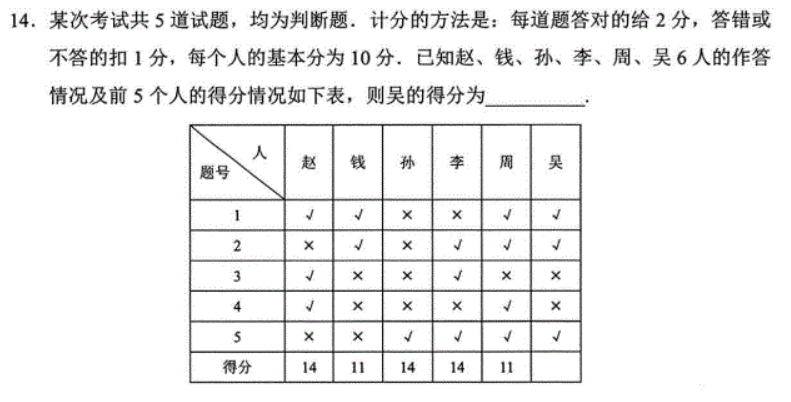

### 题目描述

### 解析

答案给的做法是根据第一个人的答案枚举所有答案，但这种做法太唐了。

我们以 $(x,y)$ 来表示这个人对了 $x$ 题，错了 $y$ 题。则由题意可知，这五个人从左往右分别为 $(3,2),(2,3),(3,2),(3,2),(2,3)$ 。

观察一下这五个人的答案可以发现，孙和李有三题一样且分数一样，钱和周也有三题一样且分数一样。我们可以考虑从这里入手。

由于钱和周都错了两道题，所以他们要么前三题中错了两题，要么后两题中错了两题，要么前三题中和后两题中各错一题。

先看第一种情况。如果他们前三题中错了两题，就代表他们后两题都是全对，但这显然不可能。

同理，如果是第二种情况，就代表他们后两题都是全错，显然也不可能。

所以只可能是第三种情况：前三和后二各错一题。

此时我们就只需要再讨论两种情况，即后两题的答案是 $\times \surd$ 或 $\times \surd$。

如果是后两题的答案是 $\surd \times$ ，那么孙和李的后两题都是错的，等价于他们的前三题都是对的，但这显然不可能。

再看 $\times \surd$ 的情况，此时孙和李的后两题都是对的，那么他们的前三题都各错一题。而他们前三题中错的那一题显然不可能是第一题，所以第一题的答案为 $\surd$。第二题和第三题要么是 $\times \surd$，要么是 $\surd \times$，这两种情况分别带入赵的答案，最后得到正确答案为 $\surd \times \surd \times \surd$，即本空答案为 $14$。 

